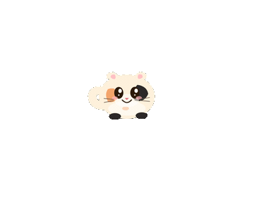
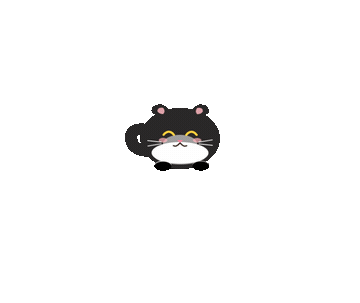
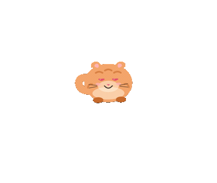
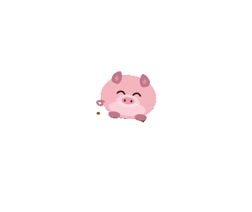
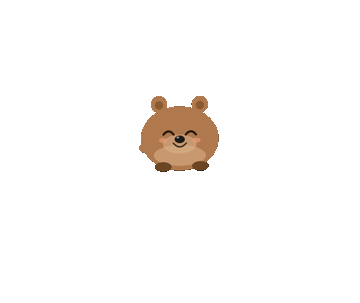

<div align="center">


# 🐾 Cat Desk Pet

[简体中文](README.md) · **English**

**A hand-drawn little animal that lives on your desktop.**
It wanders around, gets sleepy, yawns, chases its own tail — and every now and then it'll carry a leaf over just to give it to you.
It won't get in the way of your work. It's just here for the moments when you need a small break.

Tauri 2 · hand-drawn SVG · ~10 MB · macOS / Windows


[⬇️ Download & Play](#-download--play) · [🐱 Meet Them](#-meet-them) · [✨ What It Does](#-what-it-does) · [🛠 Build from Source](#-build-from-source)

</div>

---

## ⬇️ Download & Play

Grab one from **[Releases](../../releases)** and double-click. No runtime, no setup:

| Platform | File | Notes |
|---|---|---|
| 🪟 Windows portable | `cat-desk-pet.exe` | **Single file**, just run it — touches no registry |
| 🪟 Windows installer | `*-setup.exe` / `*.msi` | Regular installer with a Start Menu shortcut |
| 🍎 macOS | `*.dmg` | Universal — runs on both Intel and Apple Silicon |

> The first launch gets blocked because the app is unsigned. That's expected:
> - **macOS**: right-click the `.app` → Open → Open anyway (or `xattr -dr com.apple.quarantine /Applications/CatDeskPet.app`)
> - **Windows**: SmartScreen popup → More info → Run anyway

The pet stays out of your Dock / taskbar and won't steal Cmd+Tab focus. **Right-click it** to change its coat, toss a toy, send it to sleep, take a photo, or quit.

---

## 🐱 Meet Them

Three species, ten coats, switchable any time from the right-click menu. Every one is hand-drawn SVG — right down to the expressions.


| Species | Coats |
|---|---|
| 🐈 **Cat** | Orange · Calico · Cow · Grey tabby · Tuxedo |
| 🐷 **Pig** | Pink · Cream |
| 🐻 **Bear** | Brown · Black · Polar |

Switching species is more than a reskin: the sounds, the favorite food, the walking speed, and the species-only moves all change with it.

---

## ✨ What It Does

There's a lot packed into one small animal — much of it only shows up once you've kept it around a while. Here's the full repertoire.

<table align="center">
  <tr>
    <td align="center"><br /><b>Knead</b></td>
    <td align="center"><br /><b>Chase its tail</b></td>
    <td align="center"><br /><b>Roll belly-up</b></td>
  </tr>
  <tr>
    <td align="center"><br /><b>Make a heart</b></td>
    <td align="center"><br /><b>🐷 Mud roll</b></td>
    <td align="center"><br /><b>🐻 Back scratch</b></td>
  </tr>
</table>

**Everyday moves** (it does these on its own)
Sit · Yawn · Stretch · Look around · Curl its tail · Shake · Roll over · Loaf · Stare into space · Wiggle · Scratch an itch · Sniff the air · Sniff the ground · Sneeze · Fold its paws · Lie on its side · Wash its face · Knead · Chase its own tail · Roll belly-up asking to be rubbed

**Tricks**
Meow · Make a heart · Spin · Pounce · Happy jump · Get grumpy · Wave hello · Get shy · Swat at your cursor · Blow you a kiss

**Movement & gait**
Wander · Trot · Jump · Pause · Zoomies; in a good mood it breaks into a bouncy step with its tail held high, in a low mood it trudges along; a landing-style 3D turn

**Hunting**
Dash · Bounding leaps · Paw swat · Leap-and-swat combo

**Interacting with you**
Click to tease it (meow / heart / spin / pounce) · Feed it 🐟 · Pet it (purring~) · Pick it up and drag it (it gets dizzy when you let go) · Its eyes follow your cursor within a small range

**Eating & sleeping**
Eats, then licks its lips and hiccups; it gets tired and sleepy, falls asleep where it stands, dreams up food bubbles with its legs twitching, and wakes up on its own; it can also go sleep in its bed

**Special events**
Carries a leaf / small gift over to you · A butterfly lands on its nose, it goes cross-eyed staring at it, then sneezes it away · Birds / butterflies fly past · Toys pop up at random (yarn ball / bouncy ball / paper wad / toy mouse / laser pointer / cat wand) for it to chase · Holiday hats appear on their own (Christmas / Halloween / New Year / Valentine's) · Photo mode flashes the whole screen white — say cheese~

**Species-only**
🐷 Pig: rolls in a mud puddle, then shakes the mud off · 🐻 Bear: backs up against the screen edge and scratches its back, blissed out

---

## 🛠 Build from Source

<details>
<summary>Click to expand the full build / CI / layout notes</summary>

### Prerequisites

| Tool | Notes |
|---|---|
| [Rust](https://rustup.rs) | `rustup-init`, defaults are fine |
| [Node.js LTS](https://nodejs.org) | For the frontend dependencies |
| Xcode CLT (macOS) | `xcode-select --install` |
| VS Build Tools 2022 (Windows) | Check **Desktop development with C++** |
| WebView2 (Windows) | Bundled with Win11; on Win10 install the [Evergreen Bootstrapper](https://developer.microsoft.com/microsoft-edge/webview2/) |

### Compile

```bash
git clone https://github.com/chinaszzt/desktop-cat
cd desktop-cat
npm install
npm run tauri build
```

Output lands in `src-tauri/target/release/bundle/` (installers) and `src-tauri/target/release/cat-desk-pet(.exe)` (a standalone single-file binary).

For a macOS universal build that covers both Intel and Apple Silicon:

```bash
rustup target add x86_64-apple-darwin aarch64-apple-darwin
npm run tauri build -- --target universal-apple-darwin
```

> macOS and Windows **cannot cross-compile to each other** (Tauri depends on each system's own WebView), so leave cross-platform artifacts to the CI below.

### Automated releases (push a tag → get a Release)

The repo ships with GitHub Actions: **push a version tag and it builds Windows and macOS in the cloud in parallel, then publishes the installers + single-file exe + universal dmg straight to Releases**:

```bash
git tag v0.1.0
git push origin v0.1.0
```

- [`.github/workflows/release.yml`](.github/workflows/release.yml) — tag-triggered, matrix-builds mac (universal) + windows, uploads to a GitHub Release
- [`.github/workflows/build-windows.yml`](.github/workflows/build-windows.yml) — runs a Windows build on every push to `main`, output kept as an Actions artifact for quick checks

### Dev mode (live tinkering)

```bash
npm run tauri dev
```

Changes to the frontend (`src/`) need a restart — Tauri only watches `src-tauri/` by default.

### Project layout

```
src/                Frontend (plain HTML + CSS + vanilla JS, no framework)
  index.html          DOM skeleton: pet / context menu / toys / food / bed
  main.js             SVG assets + behavior state machine + per-frame animation loop
  styles.css          Coat variables / expression switching / bubbles / menu
src-tauri/          Rust side
  src/lib.rs          Window config / system tray / cursor position polling
  tauri.conf.json     Window properties (transparent / always-on-top / undecorated)
docs/               Showcase art used by the README
.github/workflows/  CI: build and release
```

Under the hood it's a transparent, always-on-top, fullscreen Tauri window running a `requestAnimationFrame`-driven state machine that puppets one SVG animal — every move, expression, and bit of physics is hand-written interpolation, with no animation library involved.

</details>

## License

MIT
