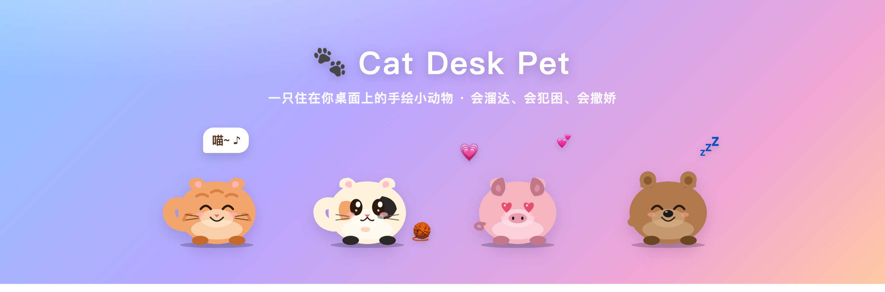
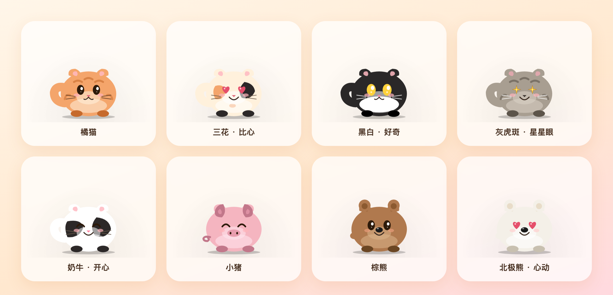

<div align="center">



# 🐾 Cat Desk Pet

**一只住在你桌面上的手绘小动物。**
它会自己溜达、犯困、打哈欠、追自己的尾巴，偶尔还叼一片叶子跑来送你。
不打扰工作，只在你需要摸鱼的时候，给你一点点治愈。

Tauri 2 · 纯手绘 SVG · 约 10 MB · macOS / Windows 通吃

[⬇️ 下载即玩](#-下载即玩) · [🐱 认识它们](#-认识它们) · [✨ 它会做什么](#-它会做什么) · [🛠 从源码构建](#-从源码构建)

</div>

---

## ⬇️ 下载即玩

去 **[Releases](../../releases)** 挑一个下载，双击就跑，不用装运行时、不用配环境：

| 平台 | 下载文件 | 说明 |
|---|---|---|
| 🪟 Windows 免安装 | `cat-desk-pet.exe` | **单文件绿色版**，双击即用，不写注册表 |
| 🪟 Windows 安装版 | `*-setup.exe` / `*.msi` | 常规安装包，带开始菜单快捷方式 |
| 🍎 macOS | `*.dmg` | 通用包，Intel 和 Apple Silicon 都能跑 |

> 首次打开系统会因为"未签名"拦一下——这是正常的：
> - **macOS**：右键 `.app` → 打开 → 仍然打开（或 `xattr -dr com.apple.quarantine /Applications/CatDeskPet.app`）
> - **Windows**：SmartScreen 弹窗 → More info → Run anyway

小动物不会占用 Dock / 任务栏，也不抢 Cmd+Tab 焦点。**右键点它**就能换毛色、丢玩具、让它睡觉、拍照或退出。

---

## 🐱 认识它们

三个物种、十种毛色，右键随时切换。每一只都是纯手绘 SVG，连表情都是一笔一笔画出来的。



| 物种 | 毛色 |
|---|---|
| 🐈 **猫** | 橘猫 · 三花 · 奶牛 · 灰虎斑 · 黑白 |
| 🐷 **猪** | 粉猪 · 奶白猪 |
| 🐻 **熊** | 棕熊 · 黑熊 · 北极熊 |

换物种不只是换个皮：叫声、爱吃的东西、走路速度、专属小动作都会跟着变。

---

## ✨ 它会做什么

一只小动物身上藏了这么多动作，很多得慢慢养、慢慢逗才见得到 —— 下面是它的全部"戏码"。

**日常小动作**（它自己会演）
坐下 · 打哈欠 · 伸懒腰 · 张望 · 卷尾巴 · 抖毛 · 翻滚 · 蹲成面包 · 发呆 · 摇屁股 · 挠痒 · 闻空气 · 嗅地面 · 打喷嚏 · 收爪蹲 · 侧躺 · 洗脸 · 踩奶 · 追自己的尾巴 · 翻肚皮求摸

**表情才艺**
喵一声 · 比心 · 转圈 · 扑击 · 开心跳 · 生气 · 打招呼 · 害羞 · 拍向鼠标 · 隔屏亲亲

**移动与步态**
溜达 · 小跑 · 跳跃 · 微停 · 暴冲；心情好会变小跳步、尾巴翘高高，心情低落就蔫蔫地慢走；落地式的 3D 转身

**狩猎**
冲刺 · 连跳 · 伸爪拍 · 扑击组合

**跟你互动**
单击逗它（喵 / 比心 / 转圈 / 扑腾）· 投喂 🐟 · 抚摸（咕噜咕噜～）· 拎着拖动（松手会晕）· 眼珠在小范围里追着鼠标转

**吃与睡**
吃东西、吃完舔嘴打嗝；会累会困，困了就地睡着，睡着时做梦冒出食物泡泡、腿一抽一抽，睡饱自然醒；也可以回窝里睡

**特殊事件**
叼一片叶子 / 小礼物送到你面前 · 蝴蝶飞来落在鼻尖、盯成斗鸡眼后打喷嚏吓跑 · 小鸟 / 蝴蝶飞过 · 随机蹦出玩具（毛线球 / 弹力球 / 纸团 / 假老鼠 / 激光笔 / 逗猫棒）追着玩 · 节日自动戴帽（圣诞 / 万圣 / 新年 / 情人节）· 拍照模式全屏白闪，茄子～

**物种专属**
🐷 小猪：泥坑打滚后抖干净一身泥 · 🐻 小熊：靠着屏幕边上下蹭背，一脸陶醉

---

## 🛠 从源码构建

<details>
<summary>点击展开完整的构建 / CI / 目录说明</summary>

### 环境准备

| 工具 | 说明 |
|---|---|
| [Rust](https://rustup.rs) | `rustup-init`，全默认即可 |
| [Node.js LTS](https://nodejs.org) | 装前端依赖用 |
| Xcode CLT (macOS) | `xcode-select --install` |
| VS Build Tools 2022 (Windows) | 勾选 **Desktop development with C++** |
| WebView2 (Windows) | Win11 自带；Win10 装 [Evergreen Bootstrapper](https://developer.microsoft.com/microsoft-edge/webview2/) |

### 编译

```bash
git clone https://github.com/chinaszzt/desktop-cat
cd desktop-cat
npm install
npm run tauri build
```

产物在 `src-tauri/target/release/bundle/`（安装包）和 `src-tauri/target/release/cat-desk-pet(.exe)`（可直接运行的单文件二进制）。

macOS 想出同时兼容 Intel + Apple Silicon 的通用包：

```bash
rustup target add x86_64-apple-darwin aarch64-apple-darwin
npm run tauri build -- --target universal-apple-darwin
```

> macOS 与 Windows **无法互相交叉编译**（Tauri 依赖各自系统的 WebView），跨平台产物请交给下面的 CI。

### 自动发布（推 tag → 出 Release）

仓库配了 GitHub Actions，**打一个版本 tag 就会在云端同时编译 Windows 和 macOS，把安装包 + 单文件 exe + 通用 dmg 自动发布到 Releases**：

```bash
git tag v0.1.0
git push origin v0.1.0
```

- [`.github/workflows/release.yml`](.github/workflows/release.yml) — tag 触发，矩阵构建 mac(universal) + windows，产物传到 GitHub Release
- [`.github/workflows/build-windows.yml`](.github/workflows/build-windows.yml) — 每次推 `main` 跑一遍 Windows 构建，产物作为 Actions artifact，方便快速验证

### Dev 模式（边改边看）

```bash
npm run tauri dev
```

前端文件（`src/`）改动后需杀进程重启——Tauri 默认只 watch `src-tauri/`。

### 项目结构

```
src/                前端（纯 HTML + CSS + vanilla JS，无框架）
  index.html          DOM 骨架：宠物 / 右键菜单 / 玩具 / 食物 / 窝
  main.js             SVG 素材 + 行为状态机 + 每帧动画循环
  styles.css          毛色变量 / 表情切换 / 气泡 / 菜单
src-tauri/          Rust 端
  src/lib.rs          窗口配置 / 系统托盘 / 鼠标位置轮询
  tauri.conf.json     窗口属性（透明 / 置顶 / 无边框）
docs/               README 用的展示图
.github/workflows/  CI：构建与发布
```

技术上就是一个透明、置顶的全屏 Tauri 窗口，里面用一套 `requestAnimationFrame` 驱动的状态机操控一只 SVG 小动物——所有动作、表情、物理都是手写插值，没有用任何动画库。

</details>

## License

MIT
